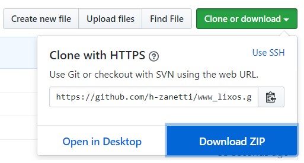

# Lixos Personalized Cloths
__Lixos__ is a web application created specifically to online cloth stores. A very simple, user friendly, and extremely complete way to create personalized shirts, hats, hoodies, and much more!  

### Check it out on your computer:
If you are not familiar with GitHub it is not a problem, I am here to help.  
At first, what you have to do is to click on the green box at the top right corner of this page written _Clone or Download_ and download the zip file.  

Once you have that, it is pretty simple. The only thing that you have to do is to extract the files to any folder in your computer, open the __index.html__ file with your favorite browser and voilà! After trying out our demo version, contact us if you are interested in having this web application personalized to your own website and automatically linked with your eCommerce system.

  

**Be careful! Don't change any name or the position in which the files are set up.**
